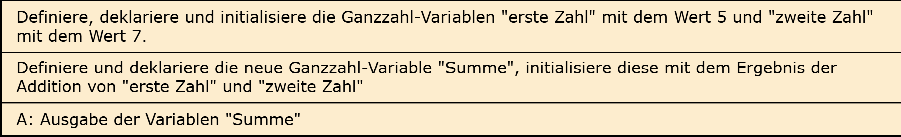
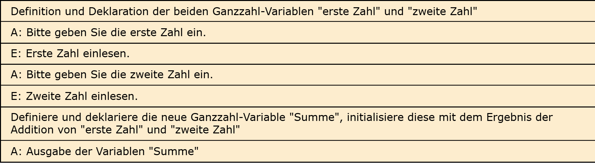

# Aufgabe 1a: Addition zweier Zahlen

Erforderliche Kenntnisse: Operatoren, Operanden

In dieser ersten Aufgabe geht es um die Berechnung einer Addition zweier Ganzzahlen. 

## Aufgabe 1a: Ohne Nutzerinteraktion

Versuchen Sie einen C-Programmcode für die Addition zweier vordefinierter Variablen zu implementieren. 

### Beispielausgabe

```clike
1 + 2 = 3
```

## Lösungen

+ Allgemeiner Hinweis +

   Bitte verwenden Sie die Lösungen lediglich, um Ihre eigenen Ergebnisse zu verifizieren. Probieren Sie sich zunächst an einer eigenen Implementierung und vergessen Sie nicht, zuerst ein Struktogramm für Ihren Programmablauf zu skizzieren.

+ Lösung: Struktogramm +
  
  

+ Lösung: Quellcode +
  
  Der Quellcode zur Lösung dieser Aufgabe ist [hier&nbsp;(Lösung A1a &gt;)](https://github.com/janschoepke/c-uebungsaufgaben/blob/main/Code-Beispiele/A01a.c) zu finden.


## Aufgabe 1b: Mit Nutzerinteraktion

Erweitern Sie das Programm, sodass die beiden Zahlen vom Benutzer eingegeben werden.

### Beispielausgabe

```clike
Bitte geben Sie die erste Ganzzahl ein: 4
Bitte geben Sie die zweite Ganzzahl ein: 6

4 + 6 = 10
```

## Lösungen

+ Lösung: Struktogramm +
  
  

+ Lösung: Quellcode +
  
  Der Quellcode zur Lösung dieser Aufgabe ist [hier&nbsp;(Lösung A1b &gt;)](https://github.com/janschoepke/c-uebungsaufgaben/blob/main/Code-Beispiele/A01b.c) zu finden.

