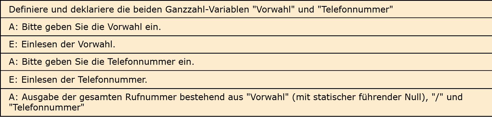

# Aufgabe 2: Telefonbuch Light

Erforderliche Kenntnisse: Eingabe und formatierte Ausgabe von Zeichen und Ziffern

Schreiben Sie ein Programm, welches nacheinander die Vorwahl und im Anschluss die Rufnummer des Programmbenutzers abfragt, und nach Abschluss der Abfrage die Nummer im im Folgenden definierten Format ausgibt. 


## Beispielausgabe

```clike
Bitte geben Sie Ihre Vorwahl ein: 01234
Bitte geben Sie Ihre Rufnummer ein: 1234567

Ihre Telefonnummer: 01234 / 1234567
```

## Hinweise zur Implementierung

+ Hinweis 1 +

  Es kann durch die Verarbeitung der Eingaben als Ganzzahlen Probleme mit führenden Nullen geben. Lösen können wir dieses Problem an dieser Stelle noch nicht, aber wir können es mit bekannten Mitteln "korrigieren".

+ Hinweis 2 +

  Im deutschsprachigen Raum starten die Vorwahlen für Festnetz- und Mobilrufnummern mit einer 0. Diese könnten wir statisch ausgeben.


## Lösungen

+ Lösung: Struktogramm +
  
  

+ Lösung: Quellcode +
  
  Der Quellcode zur Lösung dieser Aufgabe ist [hier&nbsp;(Lösung A2 &gt;)](https://github.com/janschoepke/c-uebungsaufgaben/blob/main/Code-Beispiele/A02.c) zu finden.
