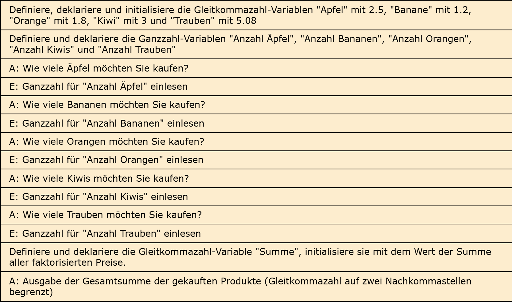

# Aufgabe 4: Obstladen

Erforderliche Kenntnisse: Operatoren und Operanden, Gleitkommazahlen, formatierte Ausgabe von Zeichen und Ziffern

Schreiben Sie ein Programm, welches für jedes im Laden angegebene Obst in einer Variable den zugehörigen Preis speichert. Angenommen, ein Kunde kauft von jedem Obst ein Exemplar. Wie viel Geld müsste der Kunde bezahlen?
(Summe ergibt sich durch Addition der Einzelpreise)

## Beispielausgabe

```clike
Summe: 13,58 Euro
```

## Lösungen

+ Allgemeiner Hinweis +

   Bitte verwenden Sie die Lösungen lediglich, um Ihre eigenen Ergebnisse zu verifizieren. Probieren Sie sich zunächst an einer eigenen Implementierung und vergessen Sie nicht, zuerst ein Struktogramm für Ihren Programmablauf zu skizzieren.

+ Lösung: Struktogramm +
  
  

+ Lösung: Quellcode +
  
  Der Quellcode zur Lösung dieser Aufgabe ist [hier&nbsp;(Lösung A4 &gt;)](https://github.com/janschoepke/c-uebungsaufgaben/blob/main/Code-Beispiele/A04.c) zu finden.