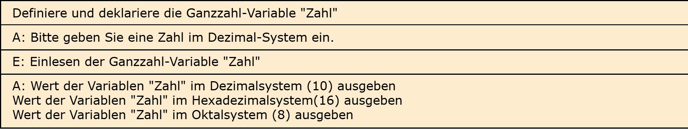

# Aufgabe 5: Umrechner

Erforderliche Kenntnisse: Eingabe und formatierte Ausgabe von Zeichen und Ziffern

Schreiben Sie ein Programm, welches eine Zahl im Dezimalsystem (zur Basis 10) annimmt, folgende Ausgabe erzeugt: 


## Beispielausgabe

```clike
Eingegebener Wert im Dezimalsystem: <wert>(10)
Eingegebener Wert im Hexadezimalsystem: <wert>(16)
Eingegebener Wert im Oktalsystem: <wert>(8)
```

## Lösungen

+ Allgemeiner Hinweis +

   Bitte verwenden Sie die Lösungen lediglich, um Ihre eigenen Ergebnisse zu verifizieren. Probieren Sie sich zunächst an einer eigenen Implementierung und vergessen Sie nicht, zuerst ein Struktogramm für Ihren Programmablauf zu skizzieren.

+ Lösung: Struktogramm +
  
  

+ Lösung: Quellcode +
  
  Der Quellcode zur Lösung dieser Aufgabe ist [hier&nbsp;(Lösung A5 &gt;)](https://github.com/janschoepke/c-uebungsaufgaben/blob/main/Code-Beispiele/A05.c) zu finden.
