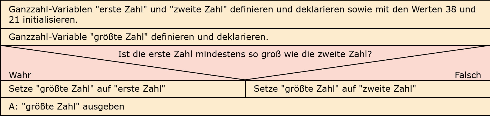
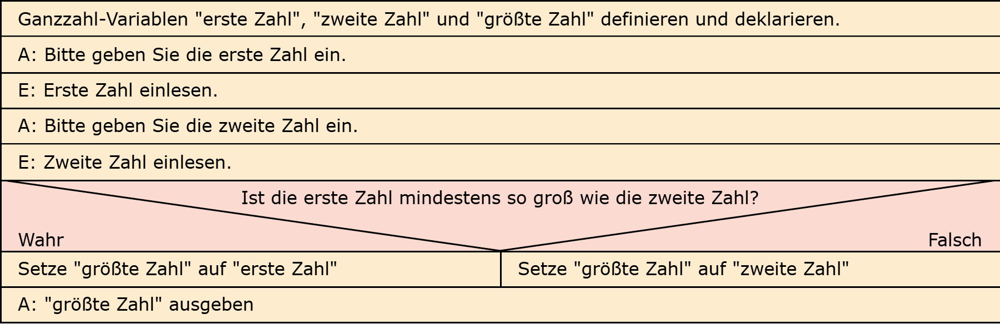

# Aufgabe 6: Zahlenvergleich 1

Erforderliche Kenntnisse: Operatoren und Operanden

## Aufgabe 6a

Implementieren Sie einen Algorithmus zur Ermittlung des Maximums **zweier** statischer Integer-Variablen.

## Aufgabe 6b

Implementieren Sie einen Algorithmus zur Ermittlung des Maximums **zweier** dynamisch eingelesener Integer-Variablen.

## Beispielausgabe

```clike
Die Zahl 8 ist die größere der beiden Zahlen. 
```

## Lösungen

+ Allgemeiner Hinweis +

   Bitte verwenden Sie die Lösungen lediglich, um Ihre eigenen Ergebnisse zu verifizieren. Probieren Sie sich zunächst an einer eigenen Implementierung und vergessen Sie nicht, zuerst ein Struktogramm für Ihren Programmablauf zu skizzieren.

+ Lösung: Struktogramm 6a +
  
  

+ Lösung: Quellcode 6a +
  
  Der Quellcode zur Lösung dieser Aufgabe ist [hier&nbsp;(Lösung A6a &gt;)](https://github.com/janschoepke/c-uebungsaufgaben/blob/main/Code-Beispiele/A06a.c) zu finden.

+ Lösung: Struktogramm 6b +
  
  

+ Lösung: Quellcode 6b +
  
  Der Quellcode zur Lösung dieser Aufgabe ist [hier&nbsp;(Lösung A6b &gt;)](https://github.com/janschoepke/c-uebungsaufgaben/blob/main/Code-Beispiele/A06b.c) zu finden.
  