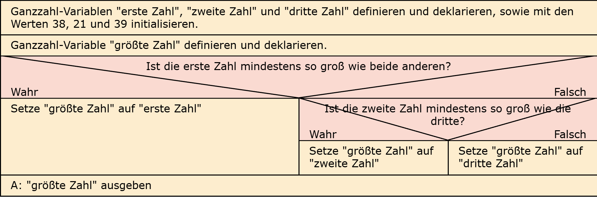

# Aufgabe 7: Zahlenvergleich 2

Erforderliche Kenntnisse: Operatoren und Operanden

Implementieren Sie einen Algorithmus zur Ermittlung des Maximums **dreier** statischer Integer-Variablen.


## Beispielausgabe

```clike
Die Zahl 8 ist die größte der drei Zahlen. 
```

## Lösungen

+ Allgemeiner Hinweis +

   Bitte verwenden Sie die Lösungen lediglich, um Ihre eigenen Ergebnisse zu verifizieren. Probieren Sie sich zunächst an einer eigenen Implementierung und vergessen Sie nicht, zuerst ein Struktogramm für Ihren Programmablauf zu skizzieren.

+ Lösung: Struktogramm +
  
  

+ Lösung: Quellcode +
  
  Der Quellcode zur Lösung dieser Aufgabe ist [hier&nbsp;(Lösung A7 &gt;)](https://github.com/janschoepke/c-uebungsaufgaben/blob/main/Code-Beispiele/A07.c) zu finden.