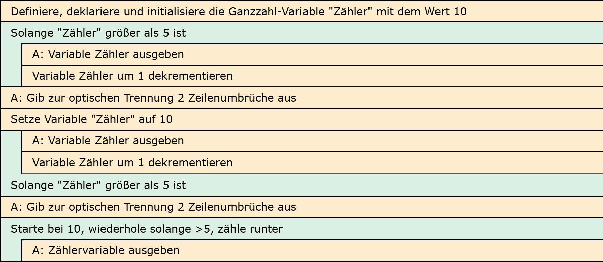

# Aufgabe 9: Schleifentypen

Erforderliche Kenntnisse: Schleifen

Implementieren Sie für jeden der drei Schleifentypen while, do-while und for die folgende Ausgabe. Alternativ und in Vorbereitung auf die Klausur können Sie auch versuchen, die Aufgabe ohne Verwendung eines Computers (also mit Zettel und Stift) zu lösen.

## Beispielausgabe

```clike
10 9 8 7 6
```

## Lösungen

+ Allgemeiner Hinweis +

   Bitte verwenden Sie die Lösungen lediglich, um Ihre eigenen Ergebnisse zu verifizieren. Probieren Sie sich zunächst an einer eigenen Implementierung und vergessen Sie nicht, zuerst ein Struktogramm für Ihren Programmablauf zu skizzieren.

+ Lösung: Struktogramm +
  
  

+ Lösung: Quellcode +
  
  Der Quellcode zur Lösung dieser Aufgabe ist [hier&nbsp;(Lösung A9 &gt;)](https://github.com/janschoepke/c-uebungsaufgaben/blob/main/Code-Beispiele/A09.c) zu finden.
