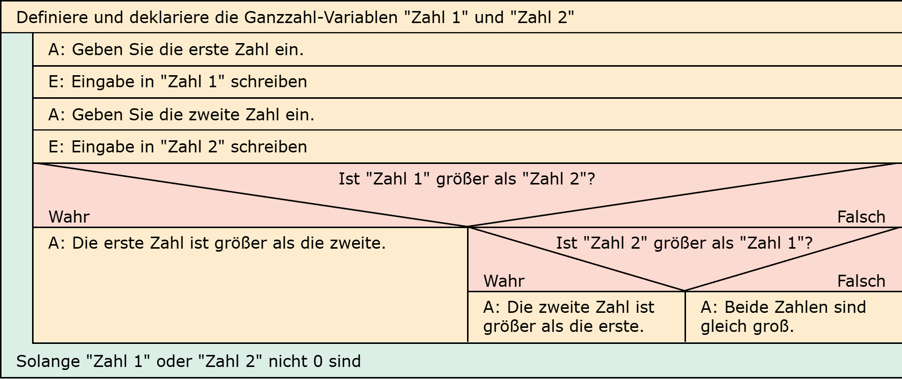

# Aufgabe 10: Zahlenvergleich 4

Erforderliche Kenntnisse: Schleifen, Fallunterscheidungen

Implementieren Sie das Programm aus Aufgabe 8 (Zahlenvergleich 3) als Schleife, sodass kontinuierlich Werte zum Vergleich abgefragt werden. 

## Aufgabe 10a

Das Programm soll beendet werden, sobald der Nutzer für eine der beiden Zahlen eine 0 eingibt. 


## Beispielausgabe

```clike
Geben Sie die erste Zahl ein: 8
Geben Sie die zweite Zahl ein: 3
Geben Sie die dritte Zahl ein: 5

Die Zahl 8 ist die größte der drei Zahlen. 

Geben Sie die erste Zahl ein: 4
Geben Sie die zweite Zahl ein: 2
Geben Sie die dritte Zahl ein: 7

Die Zahl 7 ist die größte der drei Zahlen. 

Geben Sie die erste Zahl ein: 8
Geben Sie die zweite Zahl ein: 3
Geben Sie die dritte Zahl ein: 0

Das Programm wird beendet.
```

## Aufgabe 10b

Das Programm soll beendet werden, sobald der Nutzer für beide Zahlen eine 0 eingibt. 


## Lösungen

+ Allgemeiner Hinweis +

   Bitte verwenden Sie die Lösungen lediglich, um Ihre eigenen Ergebnisse zu verifizieren. Probieren Sie sich zunächst an einer eigenen Implementierung und vergessen Sie nicht, zuerst ein Struktogramm für Ihren Programmablauf zu skizzieren.

+ Lösung: Struktogramm 10a +
  
  

+ Lösung: Quellcode 10a +
  
  Der Quellcode zur Lösung dieser Aufgabe ist [hier&nbsp;(Lösung A10a &gt;)](https://github.com/janschoepke/c-uebungsaufgaben/blob/main/Code-Beispiele/A10a.c) zu finden.

+ Lösung: Struktogramm 10b +
  
  

+ Lösung: Quellcode 10b +
  
  Der Quellcode zur Lösung dieser Aufgabe ist [hier&nbsp;(Lösung A10b &gt;)](https://github.com/janschoepke/c-uebungsaufgaben/blob/main/Code-Beispiele/A10b.c) zu finden.