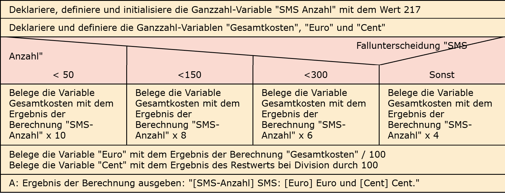
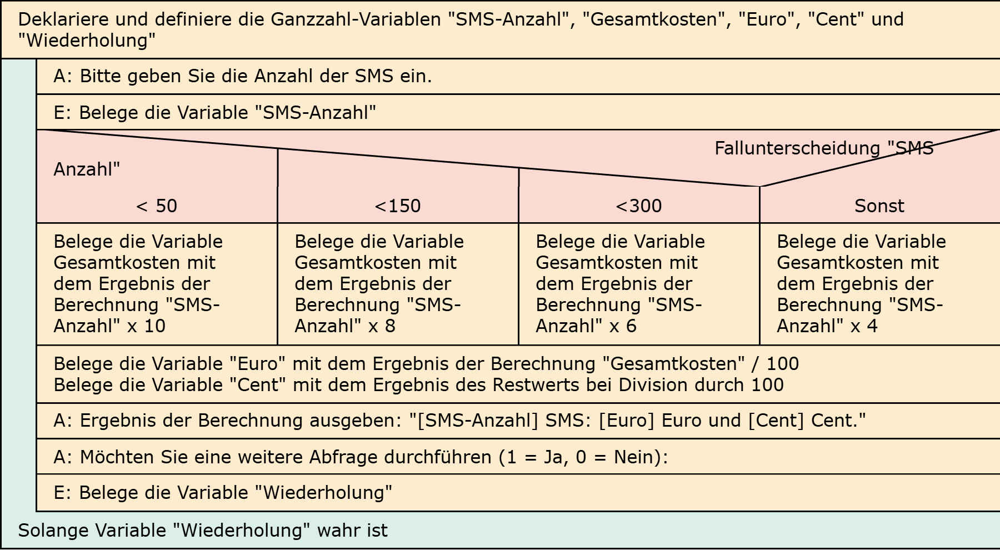

# Aufgabe 11: Telefonanbieter

Erforderliche Kenntnisse: Fallunterscheidungen, Operatoren und Operanden, Schleifen (für Aufgabe b)

Ein Telefonanbieter berechnet folgende Kosten pro SMS-Nachricht: 
- Bei weniger als 50 SMS-Mitteilungen pro Monat: je 10 Cent
- Bei weniger als 150 pro Monat: je 8 Cent
- Bei weniger als 300 pro Monat: je 6 Cent
- bei 300 oder mehr pro Monat: je 4 cent

## Aufgabe 11a: Statische Ermittlung

Schreiben Sie ein Programm, das für eine vorgegebene Anzahl von SMSen den Gesamtbetrag in Euro und Cent berechnet und ausgibt. Im Folgenden finden Sie eine beispielhafte Ausgabe:

## Beispielausgabe

```clike
217 SMS: 10 Euro und 85 Cent
```

## Aufgabe 11b: Dynamische Ermittlung

Lassen Sie die Anzahl der SMSen mit scanf einlesen und bauen Sie das Ganze in eine Schleife zur wiederholten Abfrage. 

## Beispielausgabe

```clike
Bitte geben Sie die Anzahl der SMS ein: 217
217 SMS: 10 Euro und 85 Cent
```

## Lösungen

+ Allgemeiner Hinweis +

   Bitte verwenden Sie die Lösungen lediglich, um Ihre eigenen Ergebnisse zu verifizieren. Probieren Sie sich zunächst an einer eigenen Implementierung und vergessen Sie nicht, zuerst ein Struktogramm für Ihren Programmablauf zu skizzieren.

+ Lösung: Struktogramm 11a +
  
  

+ Lösung: Quellcode +
  
  Der Quellcode zur Lösung dieser Aufgabe ist [hier&nbsp;(Lösung A11a &gt;)](https://github.com/janschoepke/c-uebungsaufgaben/blob/main/Code-Beispiele/A11a.c) zu finden.

+ Lösung: Struktogramm 11b +
  
  

+ Lösung: Quellcode +
  
  Der Quellcode zur Lösung dieser Aufgabe ist [hier&nbsp;(Lösung A11b &gt;)](https://github.com/janschoepke/c-uebungsaufgaben/blob/main/Code-Beispiele/A11b.c) zu finden.