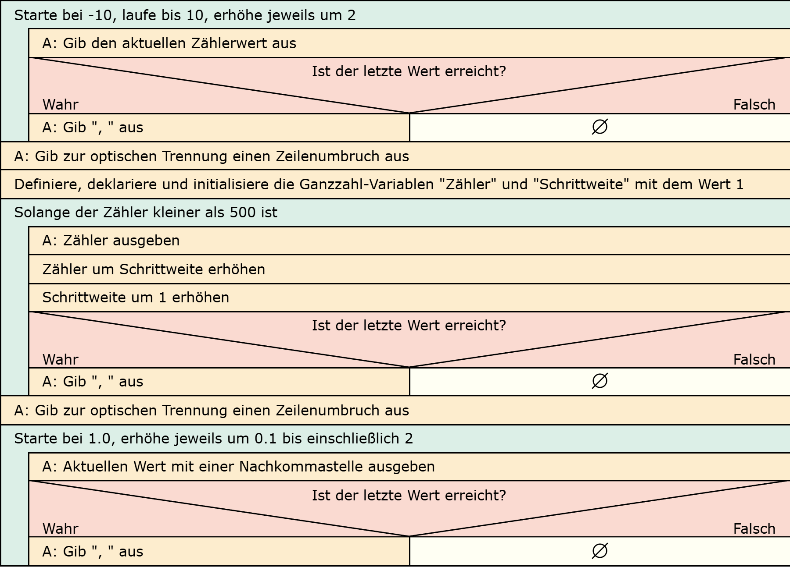

# Aufgabe 12: Sequenzen durch Schleifen

Erforderliche Kenntnisse: Schleifen, Fallunterscheidungen, Ausgabe von Zeichen und Ziffern

Schreiben Sie Schleifen, um die folgenden Sequenzen auszugeben:

## Beispielausgabe

```clike
Aufgabe 1: -10, -8, -6, …, 10
Aufgabe 2: 1, 2, 4, 7, 11, 16, … solange < 500
Aufgabe 3: 1, 1.1, 1.2, 1.3, … 1.9, 2
```

## Lösungen

+ Allgemeiner Hinweis +

   Bitte verwenden Sie die Lösungen lediglich, um Ihre eigenen Ergebnisse zu verifizieren. Probieren Sie sich zunächst an einer eigenen Implementierung und vergessen Sie nicht, zuerst ein Struktogramm für Ihren Programmablauf zu skizzieren.

+ Lösung: Struktogramm +
  
  

+ Lösung: Quellcode +
  
  Der Quellcode zur Lösung dieser Aufgabe ist [hier&nbsp;(Lösung A12 &gt;)](https://github.com/janschoepke/c-uebungsaufgaben/blob/main/Code-Beispiele/A12.c) zu finden.
