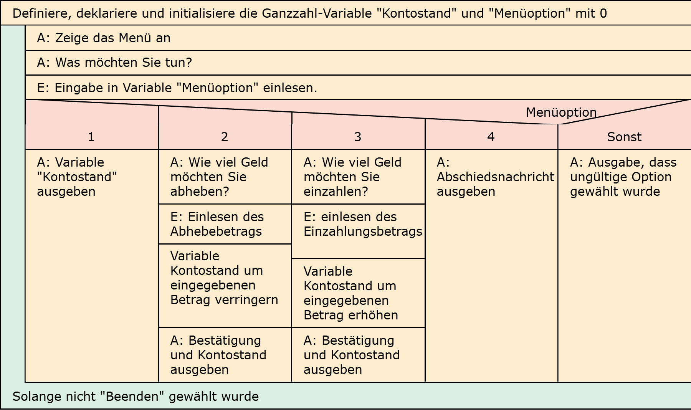

# Aufgabe 13: Bankautomat

Erforderliche Kenntnisse: Fallunterscheidungen, Schleifen

Es ist die Logik eines einfachen Bankautomaten in einem Programm zu implementieren. Legen Sie zur Verwaltung des Geldbetrags eine Variable an. Aus Gründen der Einfachheit kann hier mit Ganzzahlen gearbeitet werden. Der Bankautomat soll die folgenden Funktionen in einem Menü darstellen und implementieren: 

- Kontostand anzeigen
- Geld abheben
- Geld einzahlen
- Beenden

Es ist demnach möglich, mehrere Aktionen hintereinander auszuführen, bis die Sitzung beendet wird. Eine Beispielausführung kann folgendermaßen aussehen: 

## Beispielausgabe

```clike
Willkommen zum Bankautomaten!
Optionen:
1. Kontostand anzeigen
2. Geld abheben
3. Geld einzahlen
4. Beenden

Bitte wählen Sie eine Option: 1
Ihr Kontostand beträgt 0 Euro.
Willkommen zum Bankautomaten!
Optionen:
1. Kontostand anzeigen
2. Geld abheben
3. Geld einzahlen
4. Beenden

Bitte wählen Sie eine Option: 3
Bitte geben Sie den Betrag ein, den Sie einzahlen möchten: 250
Sie haben 250 Euro eingezahlt.
Ihr Kontostand beträgt 250 Euro.
Willkommen zum Bankautomaten!
Optionen:
1. Kontostand anzeigen
2. Geld abheben
3. Geld einzahlen
4. Beenden

Bitte wählen Sie eine Option: 2
Bitte geben Sie den Betrag ein, den Sie abheben möchten: 100
Sie haben 100 Euro abgehoben.
Ihr Kontostand beträgt 150 Euro.
Willkommen zum Bankautomaten!
Optionen:
1. Kontostand anzeigen
2. Geld abheben
3. Geld einzahlen
4. Beenden

Bitte wählen Sie eine Option: 4
Auf Wiedersehen!
```

## Lösungen

+ Allgemeiner Hinweis +

   Bitte verwenden Sie die Lösungen lediglich, um Ihre eigenen Ergebnisse zu verifizieren. Probieren Sie sich zunächst an einer eigenen Implementierung und vergessen Sie nicht, zuerst ein Struktogramm für Ihren Programmablauf zu skizzieren.

+ Lösung: Struktogramm +
  
  

+ Lösung: Quellcode +
  
  Der Quellcode zur Lösung dieser Aufgabe ist [hier&nbsp;(Lösung A13 &gt;)](https://github.com/janschoepke/c-uebungsaufgaben/blob/main/Code-Beispiele/A13.c) zu finden.
