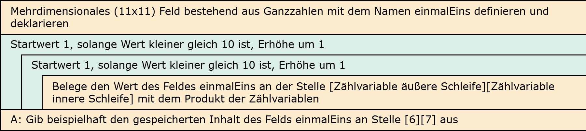

# Aufgabe 15: 1x1-Tabelle: In Feld schreiben

Erforderliche Kenntnisse: Schleifen, Felder

Schreiben Sie unter Verwendung der verschachtelten Schleifenkonstruktion die Daten der berechneten 1x1-Tabelle in ein mehrdimensionales Feld. Prüfen Sie die korrekte Belegung der Feldwerte durch eine beispielhafte Ausgabe des Werts 6 * 7. 

## Beispielausgabe

```clike
6 * 7 = 42
```

## Lösungen

+ Allgemeiner Hinweis +

   Bitte verwenden Sie die Lösungen lediglich, um Ihre eigenen Ergebnisse zu verifizieren. Probieren Sie sich zunächst an einer eigenen Implementierung und vergessen Sie nicht, zuerst ein Struktogramm für Ihren Programmablauf zu skizzieren.

+ Lösung: Struktogramm +
  
  

+ Lösung: Quellcode +
  
  Der Quellcode zur Lösung dieser Aufgabe ist [hier&nbsp;(Lösung A15 &gt;)](https://github.com/janschoepke/c-uebungsaufgaben/blob/main/Code-Beispiele/A15.c) zu finden.
