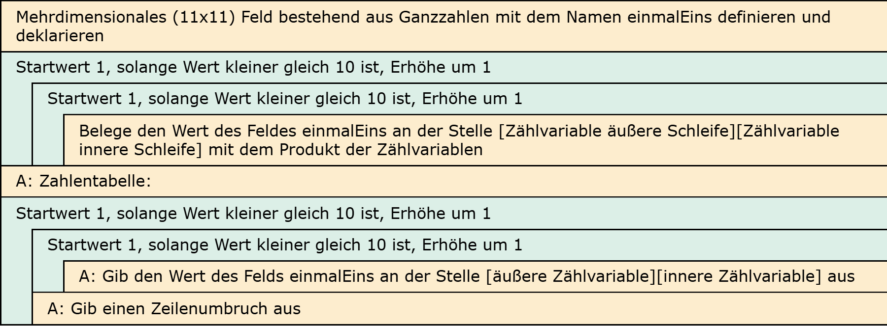

# Aufgabe 16: 1x1-Tabelle: Durch Schleife ausgeben

Erforderliche Kenntnisse: Schleifen, Felder

Ergänzen Sie das Programm zur Befüllung eines Felds mit der 1x1-Tabelle um eine entsprechende Ausgabe. Die Ausgabe soll wiederum in einer Schleifenkonstruktion, jedoch losgelöst von der Befüllung des Felds geschehen. Die Aufgabe ist erledigt, wenn die Ausgabe der der ersten Aufgabe der 1x1-Tabelle entspricht. 

## Beispielausgabe

```clike
  1   2   3   4   5   6   7   8   9  10 
  2   4   6   8  10  12  14  16  18  20 
  3   6   9  12  15  18  21  24  27  30 
  4   8  12  16  20  24  28  32  36  40 
  5  10  15  20  25  30  35  40  45  50 
  6  12  18  24  30  36  42  48  54  60 
  7  14  21  28  35  42  49  56  63  70 
  8  16  24  32  40  48  56  64  72  80 
  9  18  27  36  45  54  63  72  81  90 
 10  20  30  40  50  60  70  80  90 100 
```

## Lösungen

+ Allgemeiner Hinweis +

   Bitte verwenden Sie die Lösungen lediglich, um Ihre eigenen Ergebnisse zu verifizieren. Probieren Sie sich zunächst an einer eigenen Implementierung und vergessen Sie nicht, zuerst ein Struktogramm für Ihren Programmablauf zu skizzieren.

+ Lösung: Struktogramm +
  
  

+ Lösung: Quellcode +
  
  Der Quellcode zur Lösung dieser Aufgabe ist [hier&nbsp;(Lösung A16 &gt;)](https://github.com/janschoepke/c-uebungsaufgaben/blob/main/Code-Beispiele/A16.c) zu finden.
