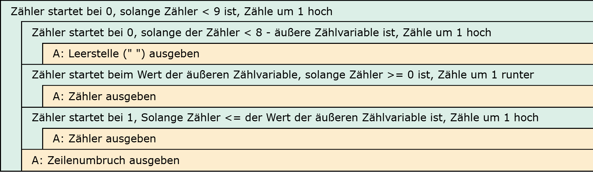

# Aufgabe 18: Zahlenpyramide

Erforderliche Kenntnisse: Schleifen, verschachtelte Schleifen

Folgende Zahlenpyramide soll auf dem Bildschirm ausgegeben werden. Entwickeln Sie einen Algorithmus, der mit Hilfe mehrere verschachtelter Schleifen die Zeichen auf dem Bildschirm ausgibt.


## Beispielausgabe

```clike
         0
        101
       21012
      3210123
     432101234
    54321012345
   6543210123456
  765432101234567
 87654321012345678
9876543210123456789
```

## Hinweise zur Implementierung

+ Hinweis 1 +

  Im ersten Schritt sollte nur jeweils die erste Ziffer jeder Zeile untereinander ausgegeben werden.

+ Hinweis 2 +

  Dann sollte diese eine Ziffer in jeder Zeile mit Hilfe von Leerzeichen so eingerückt werden, dass die Kontur der linken Pyramidenseite abgebildet wird.

+ Hinweis 3 +

  Jetzt werden in jeder Zeile die abwärts und wieder aufwärts zählenden Ziffern hinzugefügt.


## Lösungen

+ Allgemeiner Hinweis +

   Bitte verwenden Sie die Lösungen lediglich, um Ihre eigenen Ergebnisse zu verifizieren. Probieren Sie sich zunächst an einer eigenen Implementierung und vergessen Sie nicht, zuerst ein Struktogramm für Ihren Programmablauf zu skizzieren.

+ Lösung: Struktogramm +
  
  

+ Lösung: Quellcode +
  
  Der Quellcode zur Lösung dieser Aufgabe ist [hier&nbsp;(Lösung A18 &gt;)](https://github.com/janschoepke/c-uebungsaufgaben/blob/main/Code-Beispiele/A18.c) zu finden.
