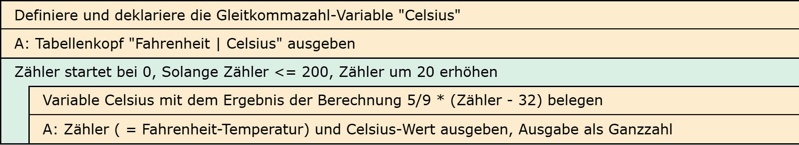
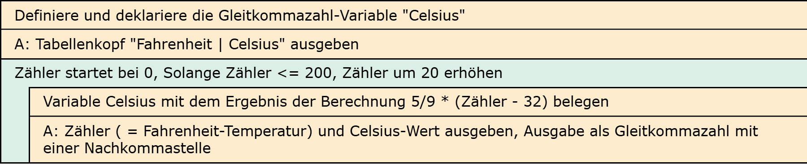

# Aufgabe 19: Temperaturrechner

Erforderliche Kenntnisse: Schleifen, Operatoren und Operanden, Eingabe und formatierte Ausgabe von Zeichen und Ziffern

Mit der formel `tc = 5/9 * (tf - 32)` kann die Temperatur von Fahrenheit `tf` in Celsius `tc` umgerechnet werden. Schreiben Sie ein Programm, das eine Temperaturtabelle für beide Einheiten auf dem Bildschirm ausgibt.

## Aufgabe 19a: Ausgabe als Ganzzahlen
Geben Sie die Tabellenwerte als ganze Zahlen aus. 

## Beispielausgabe

```clike
Fahrenheit				Celsius
0                         -17
20						  -6
40						    4
…						      …
200						    …
```

## Aufgabe 19b: Ausgabe als Gleitkommazahlen

Die Tabellenwerte sollen als Gleitkommazahlen mit einer Nachkommastelle ausgegeben werden.


## Hinweise zur Implementierung

+ Hinweis +

  Die Rechnung sollte mit Double-Zahlen erfolgen. Für die ganzzahlige Ausgabe werden die Zahlen dann entsprechend formatiert. 


## Lösungen

+ Allgemeiner Hinweis +

   Bitte verwenden Sie die Lösungen lediglich, um Ihre eigenen Ergebnisse zu verifizieren. Probieren Sie sich zunächst an einer eigenen Implementierung und vergessen Sie nicht, zuerst ein Struktogramm für Ihren Programmablauf zu skizzieren.

+ Lösung: Struktogramm 19a +
  
  

+ Lösung: Quellcode 19a +
  
  Der Quellcode zur Lösung dieser Aufgabe ist [hier&nbsp;(Lösung A19a &gt;)](https://github.com/janschoepke/c-uebungsaufgaben/blob/main/Code-Beispiele/A19a.c) zu finden.

+ Lösung: Struktogramm 19b +
  
  

+ Lösung: Quellcode 19b +
  
  Der Quellcode zur Lösung dieser Aufgabe ist [hier&nbsp;(Lösung A19b &gt;)](https://github.com/janschoepke/c-uebungsaufgaben/blob/main/Code-Beispiele/A19b.c) zu finden.
