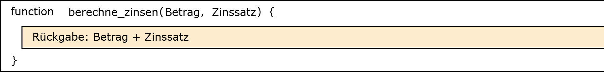
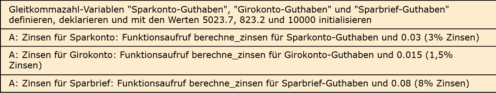

# Aufgabe 20: Zinsrechner

Erforderliche Kenntnisse: Funktionen

Ein aktuell existierendes Programm einer Bank berechnet die aktuellen Zinsen diverser Sparmodelle anhand der jeweiligen Sparsummen. Das Programm ist aktuell durch die sich wiederholende Implementierung der Zinsberechnung sehr fehleranfällig. Die aktuelle Implementierung ist: 

```clike
int main() {
    double sparkonto_guthaben = 5023.7;
    double sparkonto_zinsen = sparkonto_guthaben * 0.03;
    printf("Zinsen fuer Sparkonto: %.2f\n", sparkonto_zinsen);

    double girokonto_guthaben = 823.2;
    double girokonto_zinsen = girokonto_guthaben * 0.015;
    printf("Zinsen fuer Girokonto: %.2f\n", girokonto_zinsen);

    double sparbrief_guthaben = 10000.0;
    double sparbrief_zinsen = sparbrief_guthaben * 0.08;
    printf("Zinsen fuer Sparbrief: %.2f\n", sparbrief_zinsen);

    return 0;
}
```

Kapseln Sie die Zinsberechnung in einer Funktion, welche an drei Stellen im Code aufgerufen wird. 

## Beispielausgabe

```clike
Zinsen fuer Sparkonto: 150.71
Zinsen fuer Girokonto: 12.35
Zinsen fuer Sparbrief: 800.00
```


## Lösungen

+ Allgemeiner Hinweis +

   Bitte verwenden Sie die Lösungen lediglich, um Ihre eigenen Ergebnisse zu verifizieren. Probieren Sie sich zunächst an einer eigenen Implementierung und vergessen Sie nicht, zuerst ein Struktogramm für Ihren Programmablauf zu skizzieren.

+ Lösung: Struktogramm +
  
  

  

+ Lösung: Quellcode +
  
  Der Quellcode zur Lösung dieser Aufgabe ist [hier&nbsp;(Lösung A20 &gt;)](https://github.com/janschoepke/c-uebungsaufgaben/blob/main/Code-Beispiele/A20.c) zu finden.

