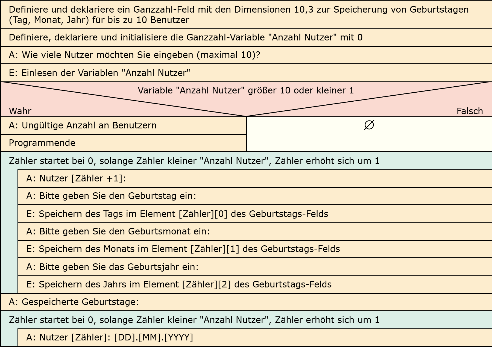

# Aufgabe 21: Geburtstagskalender Advanced

Erforderliche Kenntnisse: Schleifen, Fallunterscheidungen, Felder

Erweitern Sie das Programm des Geburtstagskalenders so, dass die eingegebenen Informationen in einem verschachtelten Feld, wie nachfolgend abgebildet, gespeichert werden. Ermöglichen Sie, dass insgesamt bis zu 10 Nutzer eingegeben werden können. Vor dem Beenden des Programms sollen die gespeicherten Nutzerdaten ausgegeben werden. 


## Beispielausgabe

```clike
Wie viele Nutzer möchten Sie eingeben (maximal 10)? 2

Nutzer 1:
Bitte geben Sie den Geburtstag ein (Tag): 5
Bitte geben Sie den Geburtsmonat ein (Monat): 7
Bitte geben Sie das Geburtsjahr ein (Jahr): 1990

Nutzer 2:
Bitte geben Sie den Geburtstag ein (Tag): 15
Bitte geben Sie den Geburtsmonat ein (Monat): 12
Bitte geben Sie das Geburtsjahr ein (Jahr): 1985

Gespeicherte Geburtstagsdaten:
Nutzer 1: 05.07.1990
Nutzer 2: 15.12.1985
```

## Lösungen

+ Allgemeiner Hinweis +

   Bitte verwenden Sie die Lösungen lediglich, um Ihre eigenen Ergebnisse zu verifizieren. Probieren Sie sich zunächst an einer eigenen Implementierung und vergessen Sie nicht, zuerst ein Struktogramm für Ihren Programmablauf zu skizzieren.

+ Lösung: Struktogramm +
  
  

+ Lösung: Quellcode +
  
  Der Quellcode zur Lösung dieser Aufgabe ist [hier&nbsp;(Lösung A21 &gt;)](https://github.com/janschoepke/c-uebungsaufgaben/blob/main/Code-Beispiele/A21.c) zu finden.


