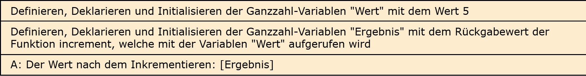
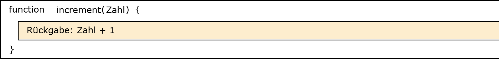

# Aufgabe 22: Inkrement-Funktion

Erforderliche Kenntnisse: Funktionen

Schreiben Sie eine Funktion mit dem Namen `increment`. Die Funktion akzeptiert Ganzzahlen als Parameter. die Funktion soll die übergebene Zahl um 1 erhöhen und zurückgeben. 

## Beispielausgabe

```clike
Der Wert nach dem Inkrementieren: 6
```

## Lösungen

+ Allgemeiner Hinweis +

   Bitte verwenden Sie die Lösungen lediglich, um Ihre eigenen Ergebnisse zu verifizieren. Probieren Sie sich zunächst an einer eigenen Implementierung und vergessen Sie nicht, zuerst ein Struktogramm für Ihren Programmablauf zu skizzieren.

+ Lösung: Struktogramm +
  
  

  

+ Lösung: Quellcode +
  
  Der Quellcode zur Lösung dieser Aufgabe ist [hier&nbsp;(Lösung A22 &gt;)](https://github.com/janschoepke/c-uebungsaufgaben/blob/main/Code-Beispiele/A22.c) zu finden.