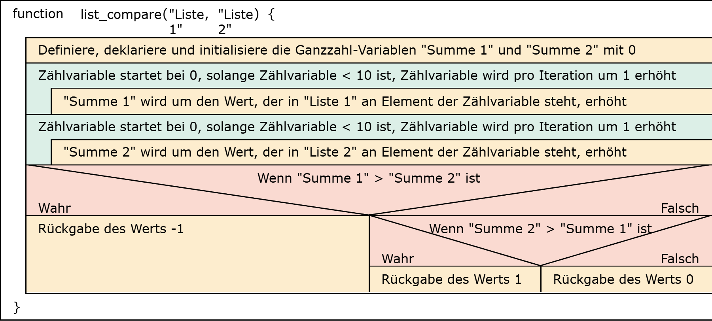
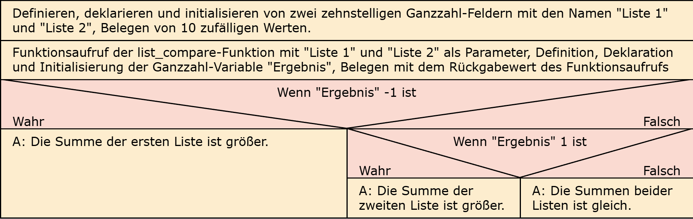

# Aufgabe 23: Funktion nach Anweisung 

Erforderliche Kenntnisse: Funktionen, Schleifen, Fallunterscheidungen, Felder

Programmieren Sie eine Funktion mit dem Namen `list_compare` wie folgt: 
- Die Funktion soll zwei Felder mit Integer-Werten als Parameter akzeptieren.
- Die als Parameter übergebenen Felder enthalten jeweils 10 Werte
- Die Funktion soll für jedes Feld die Summe der Elemente ermitteln
- Die Funktion soll -1 zurückgeben, wenn die Summe der Elemente der ersten Liste größer ist
- Die Funktion soll 1 zurückgeben, wenn die Summe der Elemente der zweiten Liste größer ist
- Die Funktion soll 0 zurückgeben, wenn die Summe der Elemente der beiden Listen gleich ist


## Beispielausgabe

```clike
1
```

## Lösungen

+ Allgemeiner Hinweis +

   Bitte verwenden Sie die Lösungen lediglich, um Ihre eigenen Ergebnisse zu verifizieren. Probieren Sie sich zunächst an einer eigenen Implementierung und vergessen Sie nicht, zuerst ein Struktogramm für Ihren Programmablauf zu skizzieren.

+ Lösung: Struktogramm +
  
  

  

+ Lösung: Quellcode +
  
  Der Quellcode zur Lösung dieser Aufgabe ist [hier&nbsp;(Lösung A23 &gt;)](https://github.com/janschoepke/c-uebungsaufgaben/blob/main/Code-Beispiele/A23.c) zu finden.