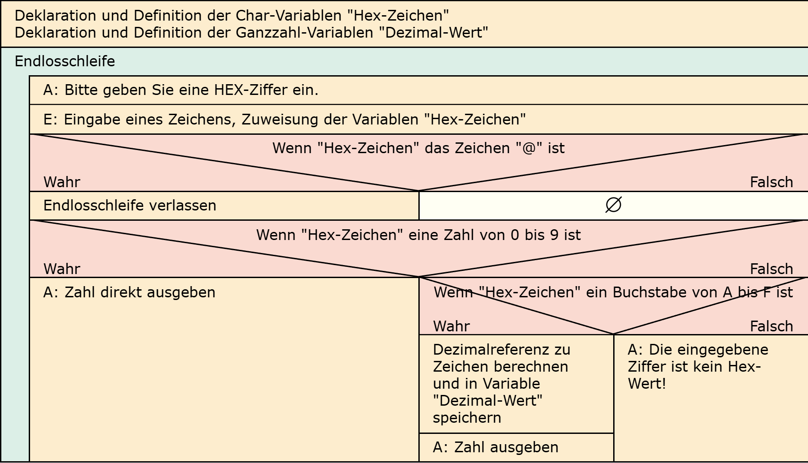

# Aufgabe 24: Zahlenumwandlung Hex/Dezimal

Erforderliche Kenntnisse: Schleifen, Fallunterscheidungen, Operatoren und Operanden, Eingabe, Berechnung und formatierte Ausgabe von Zeichen und Ziffern

Ein Programm soll in einer Schleife den Dezimalwert einer eingegebenen Hex-Ziffer berechnen und ausgeben. Wichtig ist, dass eine Berechnung, und nicht nur eine durch printf() formatierte Ausgabe erfolgt. Falls das eingegebene Zeichen nicht zu einer Hex-Zahl gehört, erfolgt eine Fehlermeldung. Der Eingabewert @ (ASCII-Wert: 64) soll das Programm beenden.

Sie brauchen hierfür keine Funktionen aus den Bibliotheken string.h, ctype.h.

## Beispielausgabe

```clike
Bitte geben Sie eine Hex-Ziffer ein: F
Die Ziffer hat den Wert 15.

Bitte geben Sie eine Hex-Ziffer ein: 3
Die Ziffer hat den Wert 3.

Bitte geben Sie eine Hex-Ziffer ein: z
Die eingegebene Ziffer ist kein Hex-Wert!
```

## Hinweise zur Implementierung

+ Hinweis 1 +

  Die Eingabe erfolgt durch das Einlesen einzelner ASCII-Zeichen. 


+ Hinweis 2 +

  ASCII-Werte: ‘A’ = 65; ‘a’ = 97, ‘0’ = 48


## Lösungen

+ Allgemeiner Hinweis +

   Bitte verwenden Sie die Lösungen lediglich, um Ihre eigenen Ergebnisse zu verifizieren. Probieren Sie sich zunächst an einer eigenen Implementierung und vergessen Sie nicht, zuerst ein Struktogramm für Ihren Programmablauf zu skizzieren.

+ Lösung: Struktogramm +
  
  

+ Lösung: Quellcode +
  
  Der Quellcode zur Lösung dieser Aufgabe ist [hier&nbsp;(Lösung A24 &gt;)](https://github.com/janschoepke/c-uebungsaufgaben/blob/main/Code-Beispiele/A24.c) zu finden.