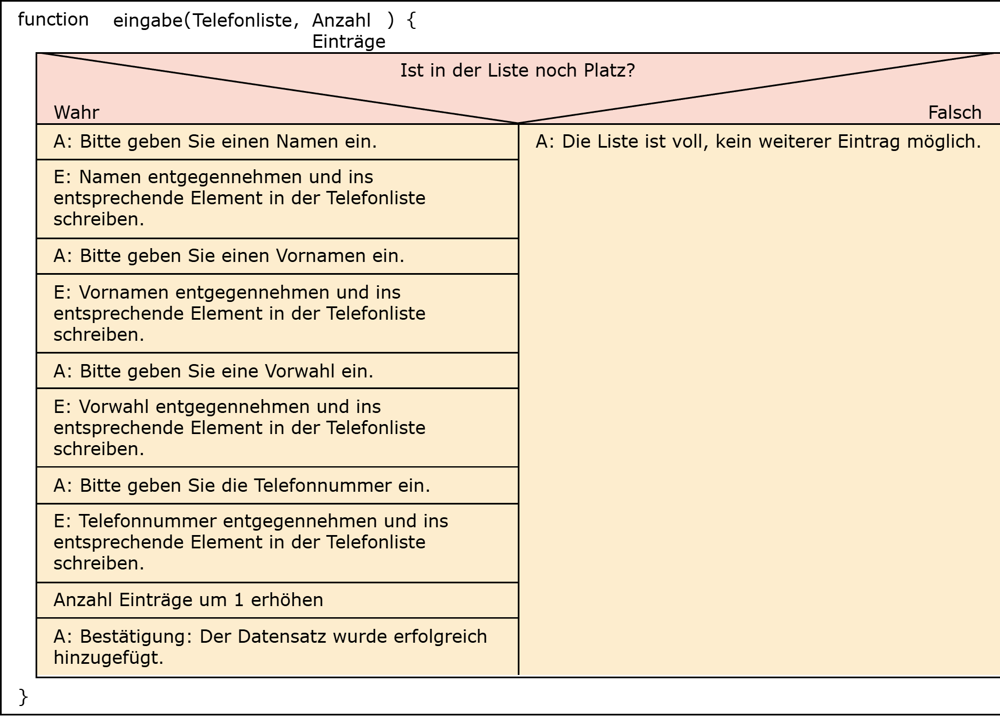
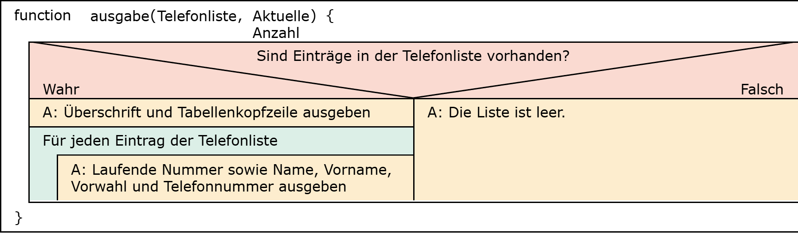
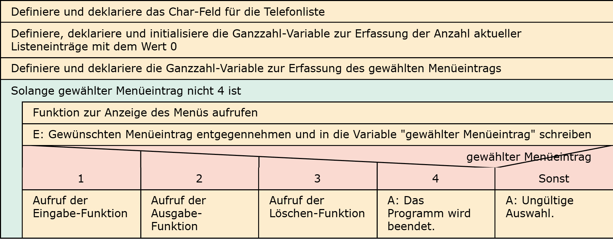

# Aufgabe 25: Telefonliste Advanced

Erforderliche Kenntnisse: Funktionen, Fallunterscheidungen, Felder, Schleifen, Zeiger (Call-by-Reference)

Schreiben Sie ein Programm, das eine Telefonliste mit einer Maximallänge von 10 Einträgen verwaltet. Für jeden Teilnehmer soll der Name, der Vorname, die Vorwahl und die Telefonnummer gespeichert werden. Die Datensätze werden in einem Feld gespeichert. 

Mit Hilfe eines Menüs sollen folgende Funktionen gewählt werden können: 
- **Eingabe**: Falls noch Platz auf der Liste ist, werden Name, Vorname, Vorwahl und Telefonnummer vom Nutzer abgefragt und entsprechend in der Liste gespeichert
- **Ausgabe**: Auf dem Bildschirm wird eine Tabelle der Daten ausgegeben.
- **Loeschen**: Die Nummer des zu löschenden Datensatzes wird abgefragt. Die übrigen Datensätze müssen so verschoben werden, dass im Feld keine Lücke entsteht. 
Programm beenden

## Lösungen

+ Allgemeiner Hinweis +

   Bitte verwenden Sie die Lösungen lediglich, um Ihre eigenen Ergebnisse zu verifizieren. Probieren Sie sich zunächst an einer eigenen Implementierung und vergessen Sie nicht, zuerst ein Struktogramm für Ihren Programmablauf zu skizzieren.

+ Lösung: Struktogramm +
  
  

  

  

  

+ Lösung: Quellcode +
  
  Der Quellcode zur Lösung dieser Aufgabe ist [hier&nbsp;(Lösung A25 &gt;)](https://github.com/janschoepke/c-uebungsaufgaben/blob/main/Code-Beispiele/A25.c) zu finden.