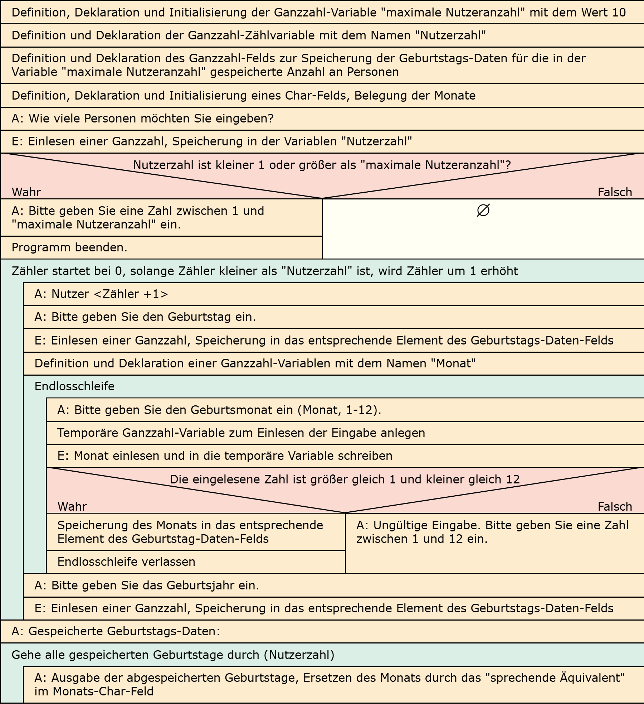
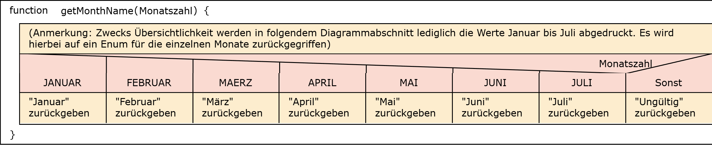

# Aufgabe 27: Geburtstagskalender Ultimativ

Erforderliche Kenntnisse: Strukturen, Enumerationen, Funktionen, Fallunterscheidungen, Felder, Schleifen, Zeiger (Call-by-Reference)

Als Basis soll das Resultat der Aufgabe "Geburtstagskalender Advanced" dienen. Erweitern Sie das Programm, sodass die Ausgabe der Monate nicht mehr in Form einer Zahl (bspw. 11), sondern in Form des jeweiligen Namens (bspw. "November") erfolgt.

## Aufgabe 27a: Verwendung eines Felds

Setzen Sie diese Anforderung um, indem Sie die Zeichenketten für die Monate innerhalb eines char* []-Felds speichern. 

## Aufgabe 27b: Verwendung einer Enumeration

Setzen Sie diese Anforderung um, indem Sie die Zeichenketten für die Monate über eine Enumeration auflösen. 

## Lösungen

+ Allgemeiner Hinweis +

   Bitte verwenden Sie die Lösungen lediglich, um Ihre eigenen Ergebnisse zu verifizieren. Probieren Sie sich zunächst an einer eigenen Implementierung und vergessen Sie nicht, zuerst ein Struktogramm für Ihren Programmablauf zu skizzieren.

+ Lösung: Struktogramm 27a +
  
  

+ Lösung: Quellcode 27a +
  
  Der Quellcode zur Lösung dieser Aufgabe ist [hier&nbsp;(Lösung A27a &gt;)](https://github.com/janschoepke/c-uebungsaufgaben/blob/main/Code-Beispiele/A27a.c) zu finden.

+ Lösung: Struktogramm 27b +

    

+ Lösung: Quellcode 27a +
  
  Der Quellcode zur Lösung dieser Aufgabe ist [hier&nbsp;(Lösung A27b &gt;)](https://github.com/janschoepke/c-uebungsaufgaben/blob/main/Code-Beispiele/A27b.c) zu finden.

